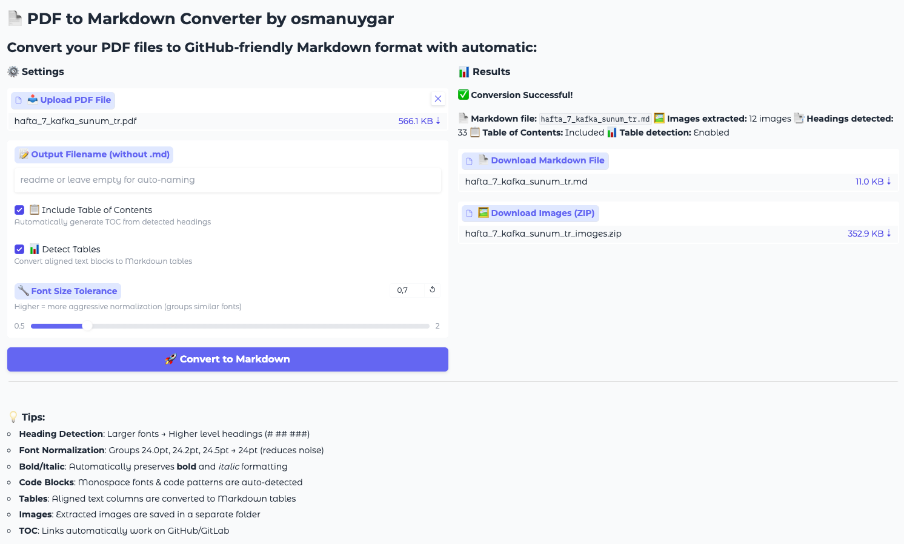

# 📄 PDF to Markdown Converter 

PDF to Markdown converter with GitHub-friendly formatting, automatic heading detection, **bold/italic** preservation, table extraction, and image processing!



## Installation

```bash
# Clone the repository or download files
git clone <repo-url>
cd pdf-to-markdown-converter

# Install dependencies
pip install -r requirements.txt
```

### Requirements

- Python 3.8+
- PyMuPDF (fitz)
- Gradio
- Pillow (optional)

## 📖 Usage

### Web UI (Gradio) - Recommended

The easiest way! 

```bash
python gradio_ui.py
```

Opens automatically in browser: `http://localhost:7860`

**Steps:**
1. Upload PDF file
2. Set output filename (optional)
3. Configure options (TOC, tables, font tolerance)
4. Click "Convert to Markdown"
5. Download Markdown and image zip files!

### CLI (Command Line)

For terminal lovers - quick conversion:

```bash
# Basic usage (auto-naming)
python pdf_to_markdown.py document.pdf

# Custom output filename
python pdf_to_markdown.py document.pdf output/README.md

# Batch processing
for file in *.pdf; do
    python pdf_to_markdown.py "$file"
done
```

###  Use in Python Code

For automation scripts:

```python
from pdf_to_markdown import PDFToMarkdownConverter

# Create converter (with font tolerance)
converter = PDFToMarkdownConverter(
    "document.pdf",
    font_size_tolerance=0.5  # 0.5pt tolerance (default)
)

# Convert to Markdown and save
output_path = converter.save_markdown(
    output_path="README.md",
    include_toc=True,      # Include TOC
    detect_tables=True     # Detect tables
)

print(f" Saved: {output_path}")

# Check extracted headings
for level, text in converter.headings:
    print(f"{'#' * level} {text}")

# Font normalization statistics
print(f"\nFont Sizes: {len(converter.normalized_font_map)} → {len(set(converter.normalized_font_map.values()))}")
```

#### Font Tolerance Settings:

```python
# Strict normalization (only very similar sizes)
converter = PDFToMarkdownConverter("doc.pdf", font_size_tolerance=0.5)

# Moderate normalization (more merging)
converter = PDFToMarkdownConverter("doc.pdf", font_size_tolerance=1.0)

# Aggressive normalization (wide range merging)
converter = PDFToMarkdownConverter("doc.pdf", font_size_tolerance=2.0)
```


##  Contributing

Pull requests are welcome! For major changes, please open an issue first.

### Development

```bash
# Install with dev dependencies
pip install -r requirements.txt


```

##  License

MIT License - Use it however you like!

##  Acknowledgments

- [PyMuPDF](https://pymupdf.readthedocs.io/) - Excellent PDF library
- [Gradio](https://gradio.app/) - Easy ML/Data UIs
- Python community ❤️

## 📧 Contact

Feel free to open an issue for questions or suggestions!

---

##  Quick Start

```bash
# Install dependencies
pip install PyMuPDF gradio

# Start web UI
python gradio_ui.py

# Or use launcher
python start.py
```

**That's it! Start converting PDFs to Markdown! 🎉**

---

**Made with ❤️ by a Big Data Engineer who loves Python & Automation** 🚀